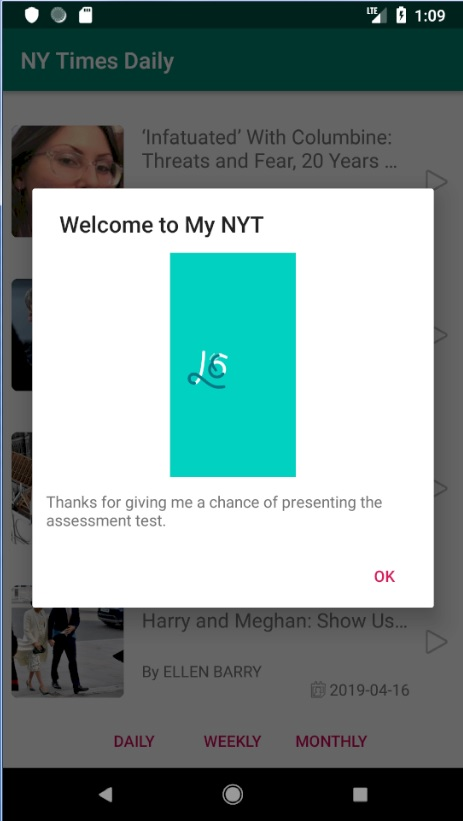

# NYTimesArticles
Assessment test project

## Installation
--------------

Clone this repository and import into **Android Studio**
```bash
git clone https://github.com/Qamar4P/NYTimesArticles.git
```

Screenshot
--------------

 


Pre-requisites
--------------

- Android Studio and Gradle v3.3.2
- Android SDK 28
- Android Build Tools v28.0.0
- Android Support Repository

Architecture components
--------------

- Live data
- RX JAVA and ViewModel
- Android architecture component

Testing
--------------

- Mockito
- JUnit
